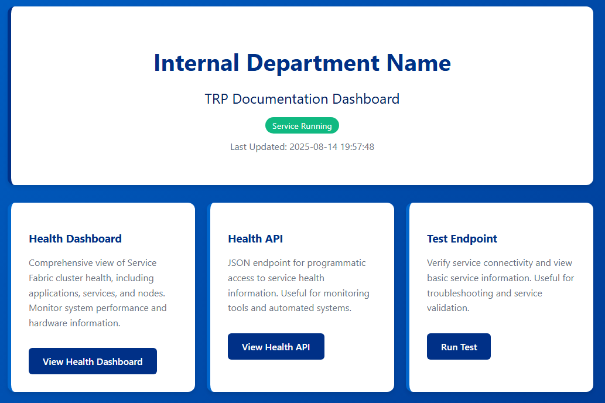
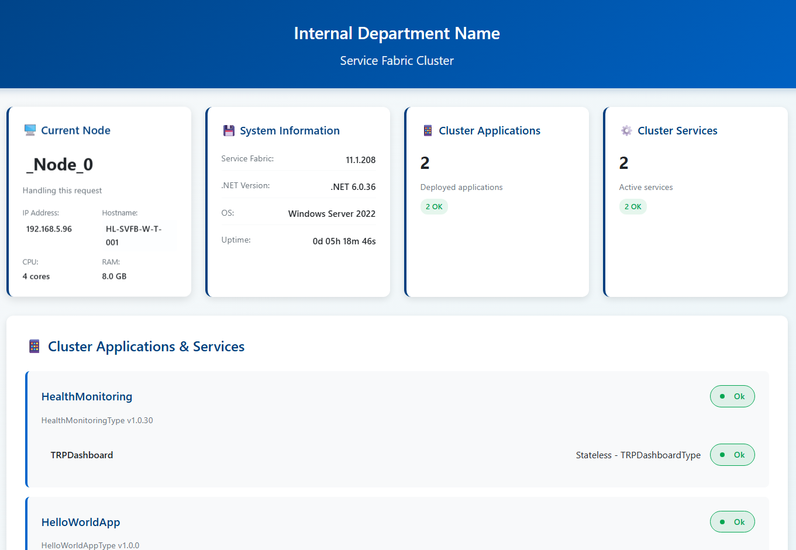
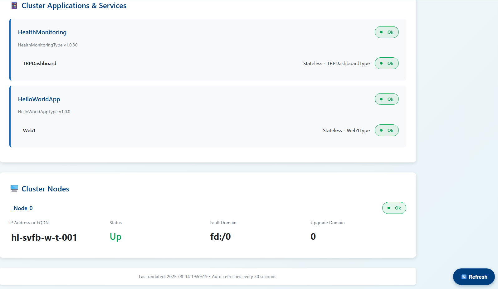
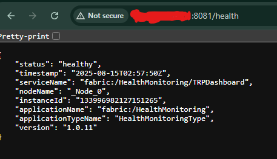
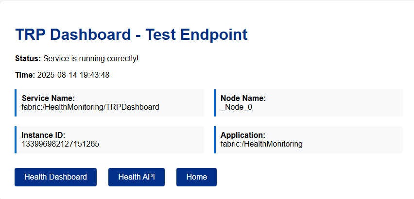

<div align="center">
  
  <h1>Service Fabric Health Dashboard</h1>
  <p><em>A lightweight, self-hosted monitoring dashboard for Azure Service Fabric clusters that integrates seamlessly with existing enterprise monitoring solutions.</em></p>
</div>


## Problem Statement

Many enterprises standardize on monitoring solutions like **Dynatrace**, **DataDog**, **Splunk**, or **New Relic** across their entire infrastructure. While Azure Service Fabric can be monitored through the Azure Portal or Application Insights, organizations that don't already use these Microsoft-specific tools face a monitoring gap.

**This dashboard solves that problem** by providing a standalone Service Fabric monitoring interface that can be:
- Deployed directly to your Service Fabric cluster
- Integrated with your existing monitoring infrastructure
- Accessed through your current dashboards and alerting systems
- Used without requiring additional Azure subscriptions or Microsoft monitoring tools

## Screenshots
## / (home endpoint)

## /health-dashboard


## /health

## /test


## Why This Solution?

### ✅ **Enterprise Integration**
- Deploy once, monitor from anywhere
- No dependency on Azure Portal access
- Compatible with existing monitoring workflows
- RESTful API endpoints for external tool integration

### ✅ **Zero External Dependencies**
- Self-contained Service Fabric application
- No Azure Monitor or Application Insights required
- No additional licensing costs
- Works in air-gapped or on-premises environments

### ✅ **Developer-Friendly**
- Familiar web-based interface
- Real-time cluster health visibility
- Easy troubleshooting and diagnostics
- Responsive design for mobile access

## Features

### 🖥️ **Cluster Overview**
- Real-time health status monitoring
- Node information and hardware details
- Application and service health tracking
- System information (OS, .NET, Service Fabric versions)

### 📊 **Application Monitoring**
- Application deployment status
- Service health and performance
- Instance counts and distribution
- Health state aggregation

### 🔄 **Real-Time Updates**
- Auto-refresh every 30 seconds
- Live health state changes
- Interactive status indicators

### 🎨 **Modern Interface**
- Professional enterprise styling
- Intuitive navigation
- Accessibility features

## Quick Start

### Prerequisites
- Azure Service Fabric cluster (local or remote)
- PowerShell execution access

### 1. Download the Application
```bash
git clone https://github.com/yourusername/service-fabric-dashboard.git
cd service-fabric-dashboard
```

### 2. Deploy to Your Cluster
```powershell
# For local cluster
.\Deploy-ServiceFabricApp.ps1

# For remote cluster
.\Deploy-ServiceFabricApp.ps1 -ClusterEndpoint "your-cluster:19000"
```

### 3. Access the Dashboard
Navigate to `http://your-cluster-node:8081` in your browser.

That's it! The dashboard is now running on your Service Fabric cluster.

## API Endpoints

The dashboard exposes several endpoints for integration with your monitoring tools:

| Endpoint | Description | Format |
|----------|-------------|---------|
| `/` | Main dashboard interface | HTML |
| `/health` | Cluster health summary | JSON |
| `/health-dashboard` | Gerneral cluster information and health statuses | HTML |
| `/test` | Service-specific Health Check Endpoint| HTML |

### Sample /health API Response
```json
{
  "status": "healthy",
  "timestamp": "2025-01-15T10:30:45Z",
  "serviceName": "fabric:/HealthMonitoring/TRPDashboard",
  "nodeName": "SF-Node-001",
  "instanceId": "132456789012345678",
  "applicationName": "fabric:/HealthMonitoring",
  "version": "1.0.30"
}
```

## Deployment Options

### Option 1: Local Development Cluster
Perfect for testing and development environments.
```powershell
.\Deploy-ServiceFabricApp.ps1
```

### Option 2: Remote Cluster
Deploy to your production or staging clusters.
```powershell
.\Deploy-ServiceFabricApp.ps1 -ClusterEndpoint "production-cluster:19000"
```

### Option 3: Custom Configuration
Override default settings as needed.
```powershell
.\Deploy-ServiceFabricApp.ps1 -Configuration "Release" -ClusterEndpoint "cluster:19000"
```

## Configuration

### Custom Branding
Update the department name in `DashboardService.cs`:
```csharp
private const string DEPARTMENT_NAME = "Your Organization Name";
```

### Port Configuration
Modify the port in `ServiceManifest.xml` if needed:
```xml
<Endpoint Name="ServiceEndpoint" Type="Input" Protocol="http" Port="8081" />
```

## Troubleshooting

### Common Issues

**Dashboard not accessible:**
- Verify Service Fabric cluster is running
- Check firewall settings for port 8081
- Ensure the application deployed successfully

**Deployment fails:**
- Verify PowerShell execution policy
- Check Service Fabric cluster connectivity
- Review Service Fabric Explorer for errors

**Empty data on dashboard:**
- Confirm Service Fabric client permissions
- Check cluster health in Service Fabric Explorer
- Verify network connectivity between nodes

### Getting Help
- Check Service Fabric Explorer: `http://your-cluster:19080`
- Review application logs in Service Fabric Explorer
- Verify cluster health and connectivity

## Contributing

We welcome contributions! Please:
1. Fork the repository
2. Create a feature branch
3. Submit a pull request with your improvements

## License

This project is licensed under the MIT License - see the [LICENSE](LICENSE) file for details.

---

⭐ **If this dashboard helps your organization, please give it a star!** ⭐

*Made with ❤️ for enterprise Service Fabric deployments*
