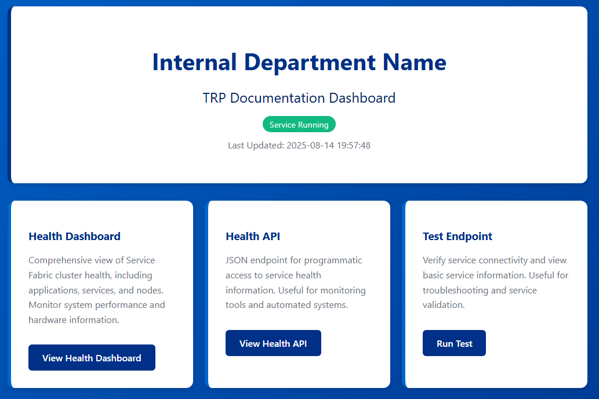
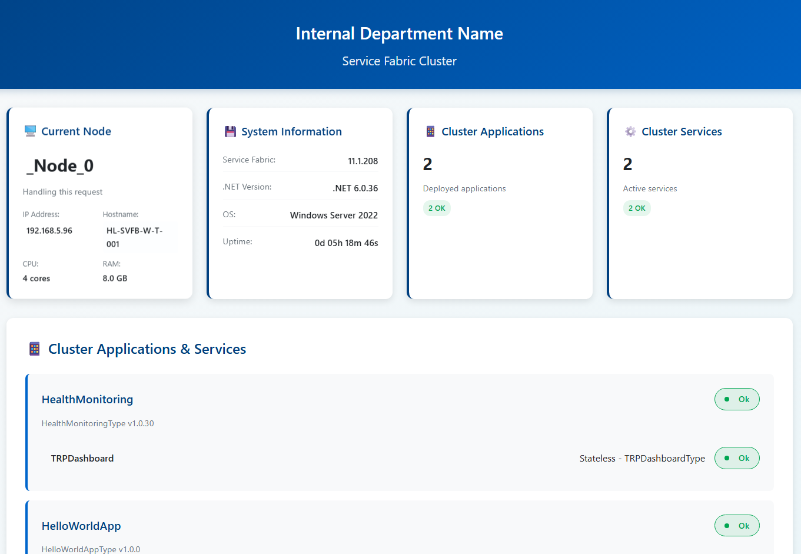
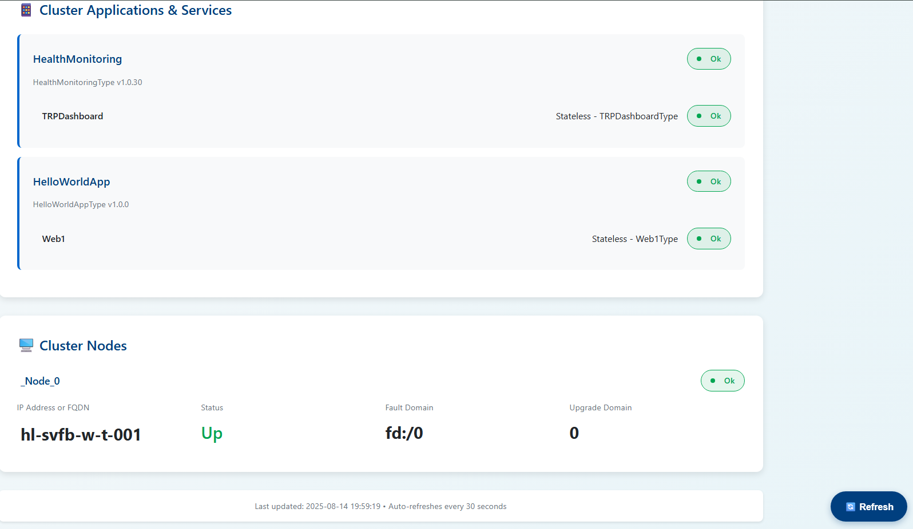
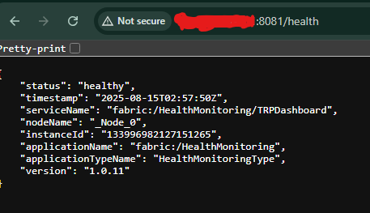
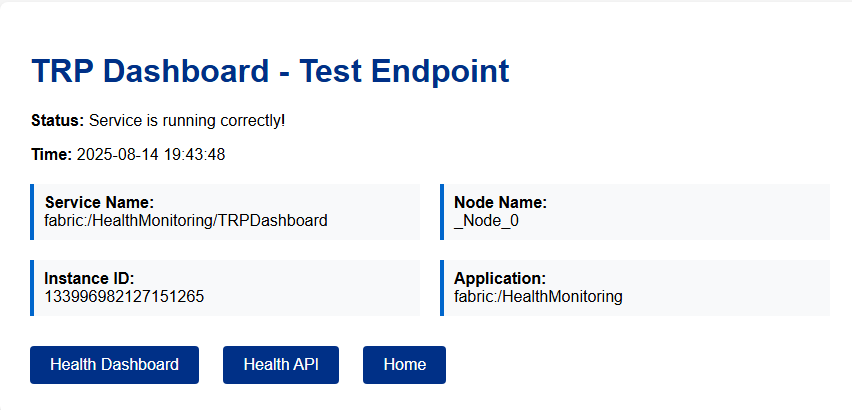

<div align="center">
  
  <h1>Service Fabric Health Dashboard</h1>
  <p><em>A lightweight, self-hosted monitoring dashboard for Azure Service Fabric clusters that integrates seamlessly with existing enterprise monitoring solutions.</em></p>
</div>


## Problem Statement

Many enterprises standardize on monitoring solutions like **Dynatrace**, **DataDog**, **Splunk**, or **New Relic** across their entire infrastructure. While Azure Service Fabric can be monitored through the Azure Portal or Application Insights, organizations that don't already use these Microsoft-specific tools face a monitoring gap.

**This dashboard solves that problem** by providing a standalone Service Fabric monitoring interface that can be:
- Deployed directly to your Service Fabric cluster
- Integrated with your existing monitoring infrastructure
- Accessed through your current dashboards and alerting systems
- Used without requiring additional Azure subscriptions or Microsoft monitoring tools

## Screenshots
## / (home endpoint)

## /health-dashboard


## /health

## /test


## Why This Solution?

### ✅ **Enterprise Integration**
- Deploy once, monitor from anywhere
- No dependency on Azure Portal access
- Compatible with existing monitoring workflows
- RESTful API endpoints for external tool integration

### ✅ **Zero External Dependencies**
- Self-contained Service Fabric application
- No Azure Monitor or Application Insights required
- No additional licensing costs
- Works in air-gapped or on-premises environments

### ✅ **Developer-Friendly**
- Familiar web-based interface
- Real-time cluster health visibility
- Easy troubleshooting and diagnostics
- Responsive design for mobile access

## Features

### 🖥️ **Cluster Overview**
- Real-time health status monitoring
- Node information and hardware details
- Application and service health tracking
- System information (OS, .NET, Service Fabric versions)

### 📊 **Application Monitoring**
- Application deployment status
- Service health and performance
- Instance counts and distribution
- Health state aggregation

### 🔄 **Real-Time Updates**
- Auto-refresh every 30 seconds
- Live health state changes
- Interactive status indicators

### 🎨 **Modern Interface**
- Professional enterprise styling
- Intuitive navigation
- Accessibility features

## Quick Start

### Prerequisites
- Azure Service Fabric cluster (local or remote)
- PowerShell execution access

### 1. Download the Application
```bash
git clone https://github.com/yourusername/service-fabric-dashboard.git
cd service-fabric-dashboard
```

### 2. Provision a TLS Certificate
For a secured (HTTPS) deploy the dashboard binds port 8472 with TLS, and Service Fabric needs a certificate to bind. For development or internal clusters, generate a self-signed cert (skip this step entirely for an unsecured/plain-HTTP deploy — see [Unsecured clusters](#unsecured-clusters)):

```powershell
$cert = New-SelfSignedCertificate `
    -DnsName "localhost" `
    -CertStoreLocation "Cert:\LocalMachine\My" `
    -KeyUsage DigitalSignature,KeyEncipherment `
    -KeyAlgorithm RSA -KeyLength 2048 `
    -NotAfter (Get-Date).AddYears(5) `
    -FriendlyName "SF Dashboard Dev Cert"

# Trust it so browsers don't warn
$root = New-Object System.Security.Cryptography.X509Certificates.X509Store "Root", "LocalMachine"
$root.Open("ReadWrite"); $root.Add($cert); $root.Close()

$cert.Thumbprint
```

Copy the thumbprint and paste it into `HealthMonitoring/ApplicationPackageRoot/ApplicationManifest.xml` under `<EndpointCertificate X509FindValue="…">`. For production, use a CA-signed certificate referenced the same way.

### 3. Build and Deploy
The fastest path from a fresh clone to a running dashboard is one command:

```powershell
.\Build-And-Deploy.ps1 -CertFindValue "localhost"
```

This runs `dotnet publish`, assembles the SF application package, and invokes the deploy script in a single step. Same script handles remote clusters too:

```powershell
.\Build-And-Deploy.ps1 `
    -ClusterEndpoint "your-cluster:19000" `
    -CertFindValue "mycluster.example.com"
```

Pass `-SkipBuild` to redeploy without rebuilding.

`Build-And-Deploy.ps1` forwards `-ServerCertThumbprint`, `-ClientCertThumbprint`, and `-UseAAD` straight to the deploy script for secured clusters — see [Deployment Options](#deployment-options) for those modes.

#### Unsecured clusters
For an unsecured / isolated dev cluster, deploy plain HTTP with no certificate anywhere:

```powershell
.\Build-And-Deploy.ps1 -Unsecured
```

`-Unsecured` rewrites the endpoint to `http` and strips the cert binding, so no `-CertFindValue`
and no TLS certificate are needed. The dashboard then serves `http://<node>:8472/` (and routes the
same way through the reverse proxy). It is **UNENCRYPTED** — use only on isolated/dev clusters.
This mirrors the sibling apps (FabricShark / FabricSight), which take the same `-Unsecured` flag.

The cert (whose subject is passed via `-CertFindValue`) must exist in `LocalMachine\My` on every cluster node. The deploy package itself is cluster-agnostic — same package everywhere, only the subject changes.

> **Prefer thumbprint lookup instead?** Edit `HealthMonitoring/ApplicationPackageRoot/ApplicationManifest.xml` and change `X509FindType="FindBySubjectName"` to `X509FindType="FindByThumbprint"`. Then pass the SHA1 thumbprint as `-CertFindValue`. Service Fabric's XSD doesn't allow parameterizing this attribute, so it's a manifest edit rather than a deploy-time flag.

### 4. Access the Dashboard
Navigate to `https://your-cluster-node:8472/health-dashboard` in your browser (or `http://…:8472/` for an unsecured deploy). The dashboard uses its own dedicated port (8472) so it can coexist with the sibling apps on a shared node; to reach it on a standard load-balancer port, front it with the reverse proxy (below).

That's it! The dashboard is now running on your Service Fabric cluster.

### Behind the Service Fabric reverse proxy
To serve the dashboard on a shared port alongside sibling apps, front it with the
[SF reverse proxy](https://learn.microsoft.com/en-us/azure/service-fabric/service-fabric-reverseproxy-setup)
(default port **19081**). It routes by a fixed path:

```
https://<node>:19081/HealthMonitoring/TRPDashboard/health-dashboard
```

The dashboard emits prefix-relative links (via a `<base href>` derived from its own Fabric service
name), so they round-trip correctly through the proxy with no configuration. The optional
`PublicPathBase` parameter overrides the auto-derived prefix if a front door adds a different one.
This dashboard has **no mTLS gate**, so no client-cert forwarding settings are involved — if you
want it gated like the sibling apps, that's a separate addition.

## API Endpoints

The dashboard exposes several endpoints for integration with your monitoring tools:

| Endpoint | Description | Format |
|----------|-------------|---------|
| `/` | Main dashboard interface | HTML |
| `/health` | Cluster health summary | JSON |
| `/health-dashboard` | General cluster information and health statuses | HTML |
| `/test` | Service-specific Health Check Endpoint| HTML |

### Sample /health API Response
```json
{
  "status": "healthy",
  "timestamp": "2025-01-15T10:30:45Z",
  "serviceName": "fabric:/HealthMonitoring/TRPDashboard",
  "nodeName": "SF-Node-001",
  "instanceId": "132456789012345678",
  "applicationName": "fabric:/HealthMonitoring",
  "version": "1.0.30"
}
```

## Deployment Options

### Option 1: Local Development Cluster
Perfect for testing and development environments.
```powershell
.\Deploy-ServiceFabricApp.ps1 -CertFindValue "localhost"
```

### Option 2: Remote Cluster
Deploy to your production or staging clusters.
```powershell
.\Deploy-ServiceFabricApp.ps1 `
    -ClusterEndpoint "production-cluster:19000" `
    -CertFindValue "production-cluster.example.com"
```

### Option 3: Custom Configuration
Override default settings as needed.
```powershell
.\Deploy-ServiceFabricApp.ps1 `
    -Configuration "Release" `
    -ClusterEndpoint "cluster:19000" `
    -CertFindValue "cluster.example.com"
```

### Option 4: Secured Cluster (X509 Client Certificate)
Most production Service Fabric clusters require client-cert auth. The deploy script accepts the server cert (to validate the cluster) and your client cert (to authenticate to it):

```powershell
.\Deploy-ServiceFabricApp.ps1 `
    -ClusterEndpoint "secured-cluster.example.com:19000" `
    -CertFindValue "secured-cluster.example.com" `
    -ServerCertThumbprint "<cluster-server-cert-thumbprint>" `
    -ClientCertThumbprint "<your-client-cert-thumbprint>"
```

The client certificate must be installed in **`CurrentUser\My` or `LocalMachine\My`** on the machine running the deploy script (the script checks both, `CurrentUser` first). The cluster must trust the cert — typically configured at cluster creation via the cluster's `ClientCertificateThumbprints` setting.

> `LocalMachine\My` is the common case for CI/CD agents running as a service account; `CurrentUser\My` is typical for interactive deploys from a developer machine.

### Option 5: Secured Cluster (Azure Active Directory)
For Azure SF clusters with AAD integration enabled:

```powershell
.\Deploy-ServiceFabricApp.ps1 `
    -ClusterEndpoint "myaadcluster.eastus.cloudapp.azure.com:19000" `
    -CertFindValue "myaadcluster.eastus.cloudapp.azure.com" `
    -ServerCertThumbprint "<cluster-server-cert-thumbprint>" `
    -UseAAD
```

A browser sign-in pops up the first time; the token caches for subsequent runs. `-ServerCertThumbprint` is still required because AAD only handles the *client* identity — TLS to the cluster is still cert-based.

## Configuration

### Custom Branding
Update the department name in `DashboardService.cs`:
```csharp
private const string DEPARTMENT_NAME = "Your Organization Name";
```

### Port Configuration
Modify the port in `ServiceManifest.xml` if needed:
```xml
<Endpoint Name="ServiceEndpoint" Type="Input" Protocol="https" Port="8472" />
```

## Security

For a secured deploy the dashboard binds to `https://+:8472/` (all network interfaces) with **TLS but no authentication** (an `-Unsecured` deploy is plain `http://+:8472/`). Anyone who can reach port 8472 on a cluster node — and accepts the TLS certificate — can:

- View cluster topology (node names, IP/FQDN, fault/upgrade domains)
- View deployed applications and services and their health states
- Read host info: OS version, RAM, CPU count, installed .NET runtimes, Service Fabric runtime version

The dashboard is **read-only** — it does not expose any mutation endpoints — but the information disclosed is still sensitive in untrusted networks.

**Recommended deployment**:

- Run on clusters whose network is already restricted (private VNet, on-prem segmented network, behind a corporate firewall).
- Restrict port 8472 inbound traffic to operator subnets via Network Security Group / firewall rules.
- Provision a real CA-signed TLS certificate for production (the sample setup uses a self-signed dev cert in `LocalMachine\My`, referenced by thumbprint in `ApplicationManifest.xml`).
- If you need broader access, place the dashboard behind a reverse proxy that enforces authentication (e.g. nginx with OAuth2-proxy, Azure Application Gateway with AAD).
- Do **not** expose the dashboard directly to the public internet.

## Troubleshooting

### Common Issues

**Dashboard not accessible:**
- Verify Service Fabric cluster is running
- Check firewall settings for port 8472
- Ensure the application deployed successfully

**Deployment fails:**
- Verify PowerShell execution policy
- Check Service Fabric cluster connectivity
- Review Service Fabric Explorer for errors

**Empty data on dashboard:**
- Confirm Service Fabric client permissions
- Check cluster health in Service Fabric Explorer
- Verify network connectivity between nodes

### Getting Help
- Check Service Fabric Explorer: `http://your-cluster:19080`
- Review application logs in Service Fabric Explorer
- Verify cluster health and connectivity

## Contributing

We welcome contributions! Please:
1. Fork the repository
2. Create a feature branch
3. Submit a pull request with your improvements

## License

This project is licensed under the MIT License - see the [LICENSE](LICENSE) file for details.

---

⭐ **If this dashboard helps your organization, please give it a star!** ⭐

*Made with ❤️ for enterprise Service Fabric deployments*
